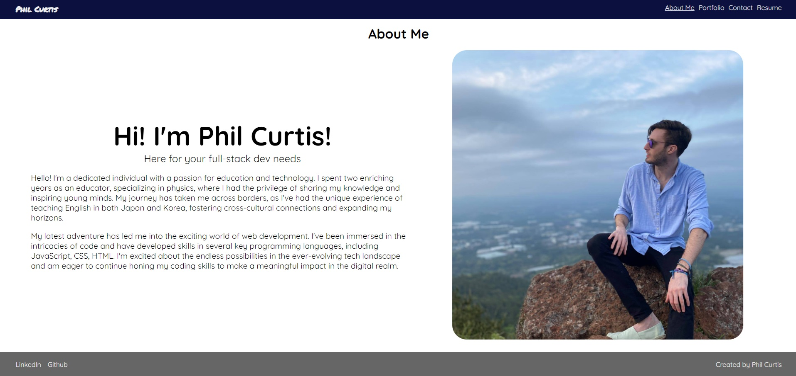

# React Portfolio
## Description
This project was undertaken as part of a coding bootcamp. The aim of this challenge was to create a portfolio website using react.

## Installation
If you wish to run this project locally on your own computer, assuming you have git installed, input the following code in your terminal.
git clone https://github.com/YOUR_USERNAME/REPO_NAME.git
## Usage
The live site may be viewed at the following url.
https://github.com/philcurtis4/react_portfolio
Here is a screenshot of the page.

    
## Credits
Created by Phil Curtis
https://coding-boot-camp.github.io/full-stack/github/professional-readme-guide
## License
This project has a MIT License. For more information read the LICENSE file.
